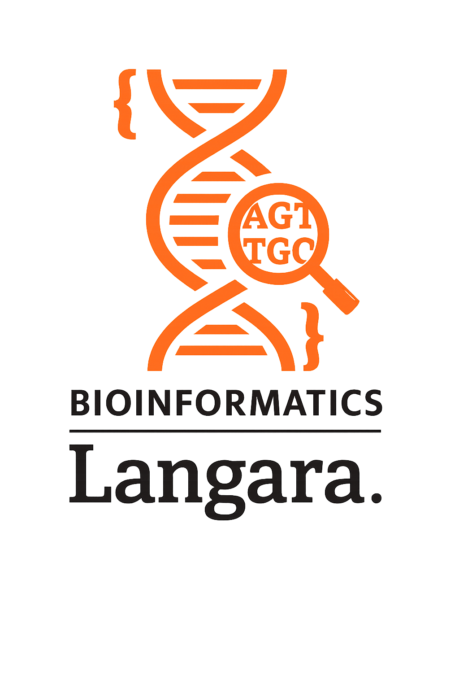

  
  &nbsp;&nbsp;&nbsp;&nbsp;
  

  The Bachelor of Bioinformatics presents

<h1 align="center">WeinR</h1>

  Workflow for Evaluating &amp; Inspecting 
  Nanopore Reads

---

## About

Welcome to the Bioinformatics project repository...
