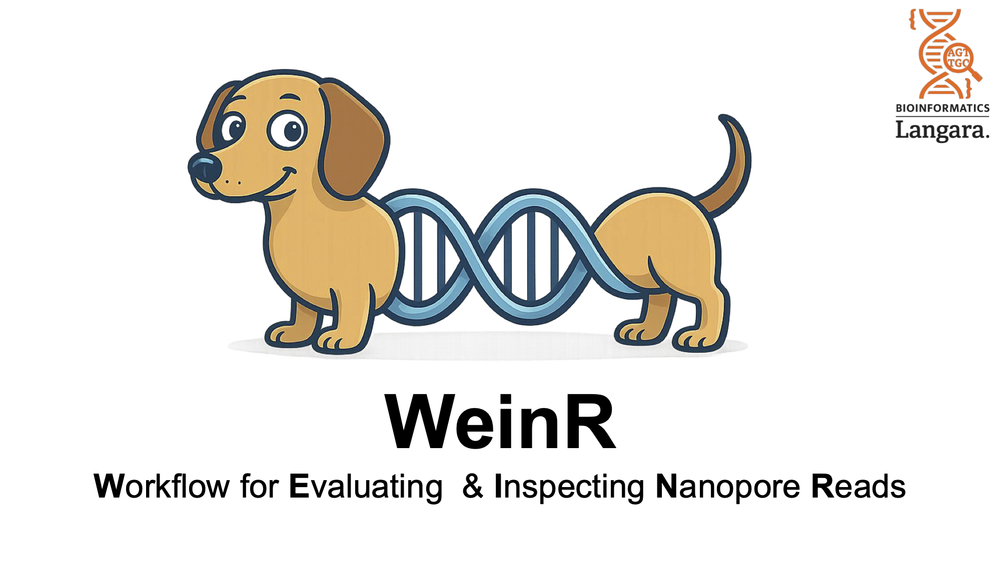

---

Welcome to **WeinR** — an R workflow for evaluating and inspecting Oxford Nanopore long-read sequencing data.

This package provides a native R-based tool to calculate key QC metrics and generate visualizations for long-read datasets directly in **RStudio**.

**WeinR is currently in beta** (first release), and we greatly appreciate any feedback or suggestions.

Feedback form:  
https://forms.office.com/r/DZ9Nkrjspq

---
## Quick Start: 

### 1. Load the package

If you are developing locally:

```r
install.packages("devtools")

devtools::install_github("idohatam/WeinR", ref = "dev")
library(WeinR)

